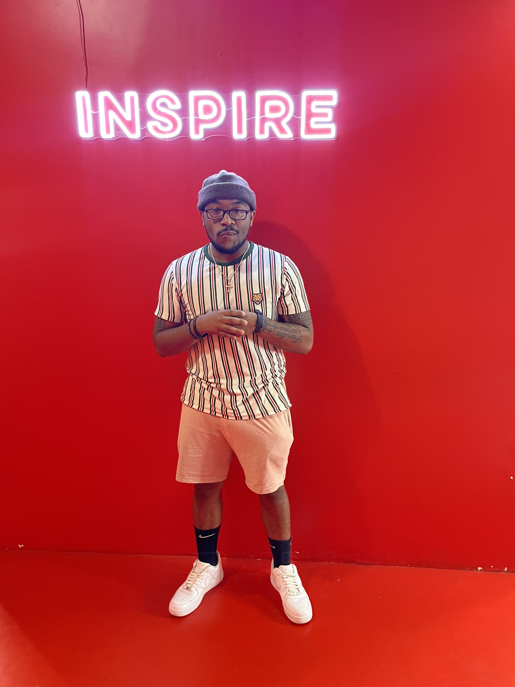
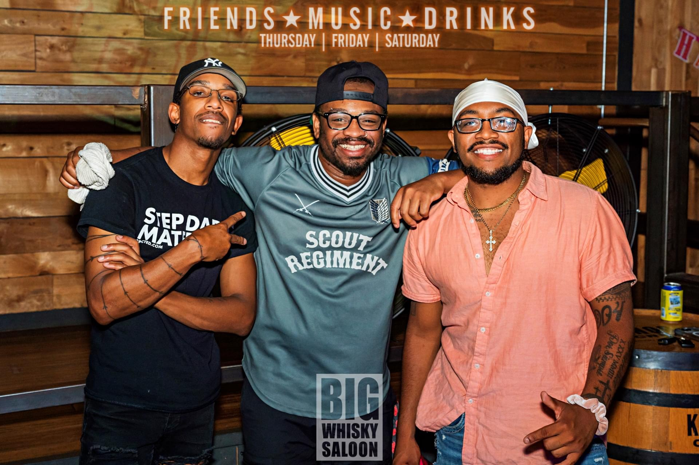
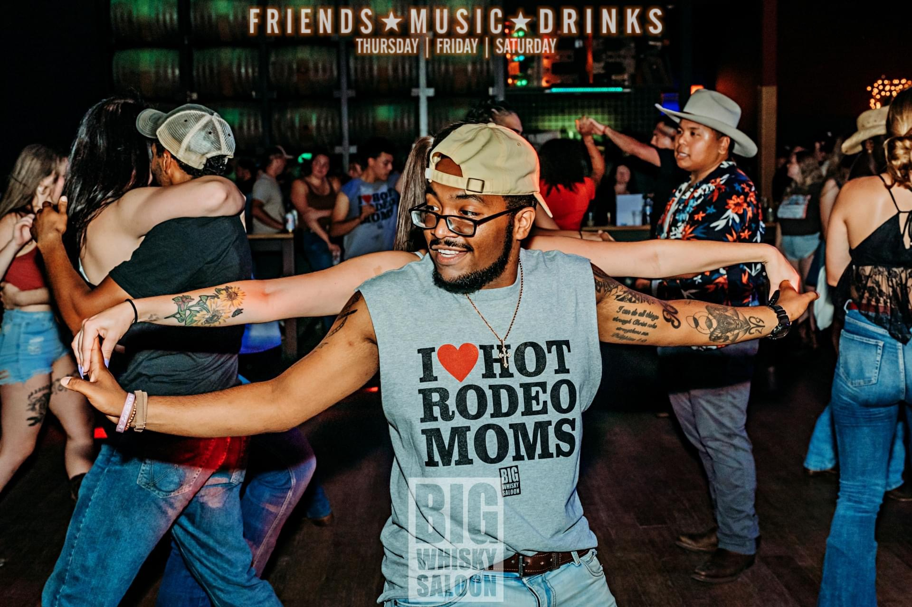
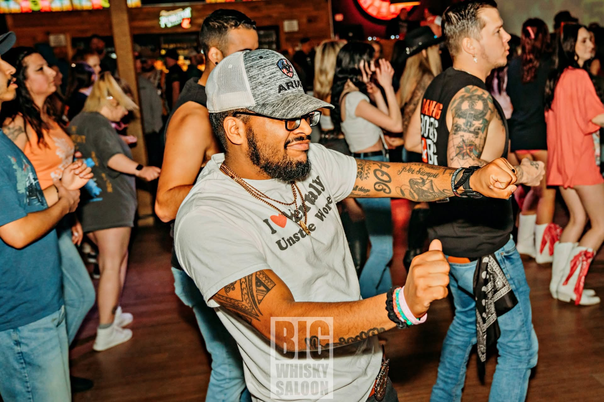
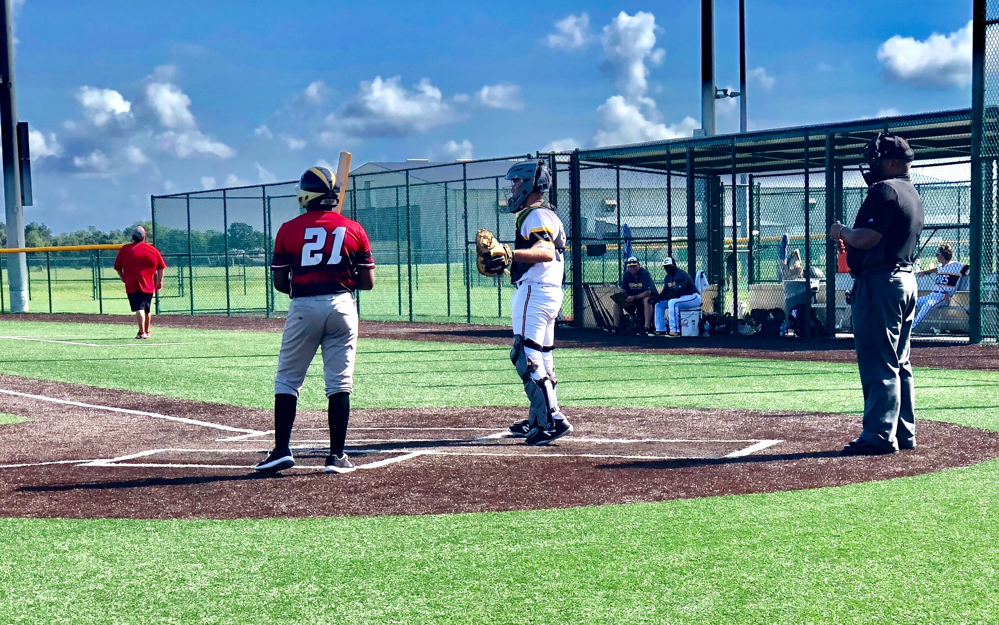

<!DOCTYPE html>
<!-- Homepage for https://mramosmerced1229.github.io/MyLifeWebsite/ -->

<html lang="en">
    <head>
        <meta description="Everything you ever wanted to know about Miggy.">
    <title>The lifestory of Miggy</title>
    </head>
    <body>
        <header>
            
<h1>"Welcome aboard the crazy life train of Miggy!! Here you'll get a sneak peek of what aspects define Miggy"</h1>
        
            
        </header>
        <main>
            <h2>Biography Summary</h2>

 <li>Miguel Ramos-Merced IV was born in Fortworth, Texas. He was put up for adoption at the young age of 1 and had been in the foster care system til the age of 2 where he later was adopted by Miguel Ramos (51) and Iris Ramos (49) at age 2. Whenever he turned 4, they later moved to Jacksonville, Fl. He is the oldest one of four siblings. Two sisters; Ailed (22) and Jazmine Ramos-Merced (17). One brother; Jorge Ramos-Merced(18). Miguel Ramos-Merced (Miggy) attended Baldwin Middle-Senior Highschool from 7th-12th grade and graduated 4th in his graduating class of 150. He did one year at Stetson University but then later opted out and joined the Navy. He did 3 years as an IT Radioman, 2 of those onboard the USS Ohio but later got out with a General Discharge. He is currently working and living in Rainer, Washington with his girlfriend in Gordons Garden Center.</li>
            <h2>Ethnicity/Background</h2>
            <ul>
                <li>Born on December 29, 2000</li>
                <li>Born in Fortworth, Texas. But later moved to Jacksonville, Fl.</li>
                <li>Adopted at the age of 2</li>
                <li>Currently <em>24</em> years old.</li>
                <li>Puertorican and African American.</li>
            </ul>
            </main>
<h2>Miggy's hobbies include but not limited to:</h2>
      <ul>
        <li><strong>Linedancing/Swingdancing</strong></li>
          

              <a href= "https://www.tiktok.com/@miguelramos3806/">Tiktok page</a>

          
          
          
          
        <li><strong>Baseball</strong></li>
          
     <h2> Lets dig a little more into the hobbies Miggy finds interesting..</h2>   

</ul>
 
<footer>&copy; Copyright 2025 Miguel Ramos-Merced</footer>
    </body>
</html>
